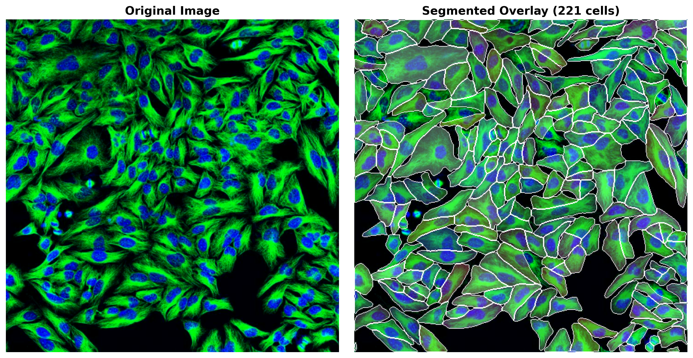

# The Existential Dread and AI Agents: A Scientific Researcher's Manifesto for Context-Aware AI Integration

## 📖 Abstract

> Despite the excitement surrounding AI integration in academic research, a lack of understanding of the capabilities and limitations of Large Language Models (LLMs) often leads to hallucinations, buggy or overengineered code, and data privacy concerns. While AI chatbots have become remarkably powerful (and potentially dangerous), aligning user expectations with model responses can be very frustrating. In this talk/tutorial, I will show examples of context engineering and effective prompting techniques that can help you navigate large codebases and projects. We will discuss agentic capabilities that leverage tools like MCPs, skills, commands, rules, and planning modes. We will explore how custom instructions can guide AI towards giving significantly better results while maintaining your data local and private. Additionally, I will demonstrate how to create custom agents and MCPs for research-specific tasks like data analysis, image analysis, and literature organization. As LLMs consume significant energy in training and inference, understanding their strengths and limitations is essential for sustainable integration.

**Keywords:** Agents, Skills, MCPs, Commands, Rules, Image Analysis, Data Analysis, Context Engineering, Custom Workflows

---

## 🚀 Introduction

This is a framework for AI-aided research using **context engineering** to guide AI agents for coding, data analysis, image analysis, and scientific computing. This repository demonstrates how to move beyond simple prompting to sophisticated agent-based workflows using rules, skills, MCPs, and subagents. The key philosophy is to provide the right structure, rules, and tools so AI agents work autonomously and reliably on complex research tasks. You can use any IDE like Cursor, VS Code, Antigravity, etc.  

### 📌 In this repository:

1. [**Rules**](#-rules) - Non-negotiable rules for the research workflow.
2. [**MCPs**](#-mcp-servers) - Model Context Protocol servers for specialized tasks. You can create your own MCPs. Like this [cellpose_mcp](https://github.com/surajinacademia/cellpose_mcp) for cell segmentation that I created one fine evening.
3. [**Skills**](#-skills) - Skills give workflow specific capabilities tuned to your research domain. 
4. [**Subagents**](#-subagents) - Specialized AI agents that other agents can call to perform specific tasks like literature review or running codes on a cluster.
5. [**Commands**](#-commands) - Command shortcuts for common workflows. Like `git` for version control. 
6. [**Resources**](Resources.md) - Ton of links and resources, some free unsolicited advice and unsubstantiated opinions.

---
> 📌 **Free Stuff for Nerds**
> 
> a. [Get 1 year of free cursor subscription if you are a student](https://cursor.com/students)

> b. [University students can 1 year free Gemini pro and Antigravity](https://one.google.com/ai-student?g1_landing_page=75)

> c. [Get 2-3 years of free Copilot + Github if you are a faculty or a student](https://docs.github.com/en/copilot/how-tos/manage-your-account/get-free-access-to-copilot-pro) (probably the best option)

> d. [Perplexity for students at $5/month](https://www.perplexity.ai/backtoschool)

> e. [Windsurf: just like Cursor but discounted for students](https://windsurf.com/pricing)

## 🎯 Bad Example Workflows

### 📊 Data Analysis

**Example:** Can you analyze the accident patterns in the dataset `road_accident_dataset.csv` by country, region, time, severity.

### 🔬 Image Analysis

**Example:***"Can you segment the cells in the image plezzzz!"*

The AI agent will use cellpose-mcp to segment image and spit you this. 

---

But this is not what you want as a researcher. You want to use the ai agent to also tell you how it got the results, verify them and adhere to you scientific workflow standards. So the workflow should depend on the level of complexity, state of your project and the goal you set up that day. 

1. Setup rules, skills, mcp servers, subagents and commands for the project.
2. Create a plan for the task that includes
    - Goal: The hypothesis you want to test, the idea you want to implement.
    - Approach
    - Example
    - Expected Output
    - Verification
3. Use a thinking/reasoning model for the plan and go over it iteratively until you are satisfied with the plan. You can then use a less powerful model to generate the code for you. 

### 📋 Rules

| Rule | Description | When Applied |
|------|-------------|--------------|
| [``.cursor/rules/rules.mdc``](.cursor/rules/rules.mdc) | Main rule file with project-wide standards and expert domains | Always |
| [``.cursor/rules/python-coding-standards.mdc``](.cursor/rules/python-coding-standards.mdc) | Python coding patterns, best practices, and visualization standards | Always |
| [``.cursor/rules/Image-analysis.mdc``](.cursor/rules/Image-analysis.mdc) | Image analysis workflow patterns and MCP tool prioritization | For `.png` files |
| [``.cursor/rules/project-repo.mdc``](.cursor/rules/project-repo.mdc) | Repository structure documentation and navigation guide for AI agents | Always |

### 🔌 MCP Servers

| MCP | Capabilities | Use Cases |
|-----|--------------|-----------|
| `napari-mcp` | Interactive image visualization and analysis | Microscopy, 3D imaging, segmentation |
| `cellpose-mcp` | Cell segmentation and quantification | Cell counting, morphology analysis |
| `fmcp` | Mathematical plotting (matplotlib, numpy, sympy) | Scientific plots, numerical computation |
| `sympy-mcp` | Symbolic mathematics and calculus | Calculus, algebra, differential equations |
| `claude-scientific-skills` | Scientific computing capabilities | Research computations |
| `data-forge` | Data manipulation and analysis | Complex data transformations |
| `notion-mcp` | Notion workspace integration | Note-taking, documentation |
| `zotero-mcp` | Zotero library access for literature management | Literature management |
| `cursor-ide-browser` | Browser automation for testing | Web testing, scraping |

### 🧠 Skills

| Skill | Purpose |
|-------|---------|
| [`.cursor/skills/scientific-writing/SKILL.md`](.cursor/skills/scientific-writing/SKILL.md) | Creates concise, structured scientific documents with LaTeX equations, integrated figures, and clear technical writing |

### 🤖 Subagents

| Subagent | Purpose |
|----------|---------|
| [`.cursor/agents/literature-review.md`](.cursor/agents/literature-review.md) | Expert literature research for biophysics and cell mechanics, semantic searches across local papers, Zotero library, and web sources |

### 💻 Commands

| Command | Purpose |
|---------|---------|
| [``.cursor/commands/git.md``](.cursor/commands/git.md) | Complete GitHub workflow: quick commit & push for small updates, detailed workflow for significant changes with proposed commit messages |

---

## 📚 Resources

- **Cursor Documentation**: [cursor.sh/docs](https://cursor.sh/docs)
- **Model Context Protocol**: [modelcontextprotocol.io](https://modelcontextprotocol.io)
- **MCP Servers**: [mcpservers.org](https://mcpservers.org)
- **Cursor Rules**: [cursor.directory](https://cursor.directory)

## 📄 License

This project is licensed under the **MIT License**—free for use, modification, and distribution with attribution. See [LICENSE](LICENSE) for the full text.

This is a workshop and tutorial repository. You are welcome to use it for learning, teaching, and building your own AI-aided research workflows.

## 📞 Contact

**Author:** Suraj Kumar Sahu  
**GitHub:** [@surajinacademia](https://github.com/surajinacademia)  
**Email:** ssahu2@ucmerced.edu  
**Affiliation:** University of California, Merced
