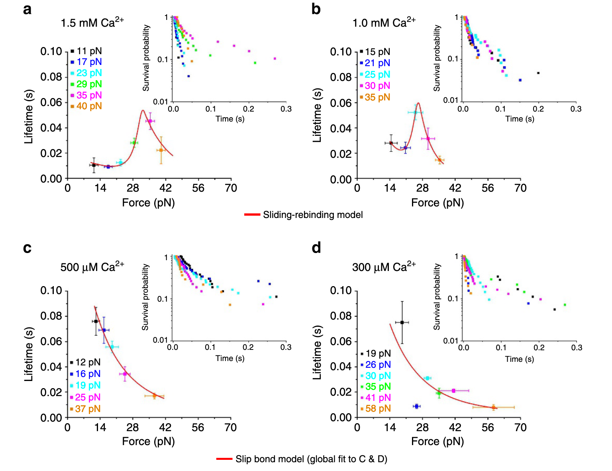
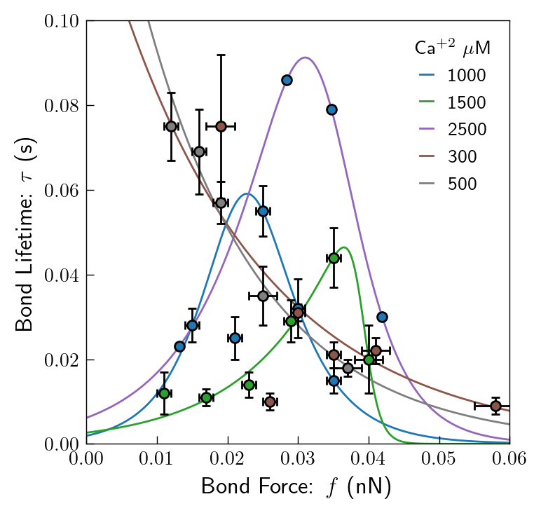

# AI Resources

> This document contains some resources (free!), opinions and some interesting articles on AI safety etc.

---

## Large language models and large reasoning models Leaderboard:

Leaderboards show comparison of different models, their capabilities, and strengths. But as the saying goes, 'the proof of the pudding is in the eating.', so experiment with your prompts.

1. **Most extensive on accuracy:** [https://scale.com/leaderboard](https://scale.com/leaderboard)
2. **Latest:** [https://huggingface.co/spaces/ArtificialAnalysis/LLM-Performance-Leaderboard](https://huggingface.co/spaces/ArtificialAnalysis/LLM-Performance-Leaderboard)
3. **Comparing Agentic Capabilities:** [https://liveswebench.ai](https://liveswebench.ai/)
4. **Testing model response using your prompts:** [https://lmarena.ai](https://lmarena.ai/)

---

## Energy usage of AI models

Understanding the environmental impacts of AI and recommendations

1. **Why AI assisted workflow could also be sustainable:**
    a. [The carbon emissions of writing and illustrating are lower for AI than for humans](https://www.nature.com/articles/s41598-024-54271-x)

    b. [Reconciling the contrasting narratives on the environmental impact of large language models](https://www.nature.com/articles/s41598-024-76682-6#ref-CR10)

2. **News articles:**

    a. [AI Large Language Models: new report shows small changes can reduce energy use by 90%](https://www.unesco.org/en/articles/ai-large-language-models-new-report-shows-small-changes-can-reduce-energy-use-90)

    b. [In a first, Google has released data on how much energy an AI prompt uses](https://www.technologyreview.com/2025/08/21/1122288/google-gemini-ai-energy/)

    c. Data Collection – Big Tech Emissions + Energy

3. **Energy Comparison Leaderboard**: [https://ml.energy/leaderboard/?__theme=light](https://ml.energy/leaderboard/?__theme=light)

---

> 📌 **Free Resources for Academics (For Grad students)**
> 
> a. [Get 1 year of free cursor subscription if you are a student](https://cursor.com/students)
> b. [University students can 1 year free Gemini pro](https://one.google.com/ai-student?g1_landing_page=75)
> c. [Get 2-3 years of free Copilot + Github if you are a faculty or a student](https://docs.github.com/en/copilot/how-tos/manage-your-account/get-free-access-to-copilot-pro) (probably the best option)
> d. [Perplexity for students at $5/month](https://www.perplexity.ai/backtoschool)
> e. [Windsurf: just like Cursor but discounted for students](https://windsurf.com/pricing)

---

## Pearls of Wisdom

> 📢 Tools like [cursor](https://cursor.com/) or VS code Copilot allows you to integrate LLMs as agent and give you control over the responses. They also allow you to control how much thinking and reasoning you want to give to a particular task. Can analyze your data, run the codes for you, debug your codes, fix your problems, test your ideas and give you a overall control of your database, codes and notes.

1. Using small as compared to the latest and the greatest can be better, overall efficient and environment friendly
2. You can use something called MCPs to link your Zotero library and your research notes in Notion to an AI model (needs some setting up but relatively [easy](https://www.anthropic.com/news/model-context-protocol))
3. Why understanding prompting is so important: [Generative AI results depend on user prompts as much as models](https://mitsloan.mit.edu/ideas-made-to-matter/study-generative-ai-results-depend-user-prompts-much-models)
4. Learn how to customize AI models tailored to your research workflow: [Custom instructions](https://code.visualstudio.com/docs/copilot/copilot-customization), [Setting up rules](https://cursor.directory/)
5. Run LLM locally for privacy and control over your data: [https://www.youtube.com/watch?v=UtSSMs6ObqY](https://www.youtube.com/watch?v=UtSSMs6ObqY)
6. From experience:
    a. Best for image analysis and dissecting papers: Claude Sonnet, Gemini Pro
    b. Best for coding: GPT4.1, Sonnet, Gemini Pro
    c. Best for brainstorming, mathematics and helping figuring out solutions: Sonnet, Gemini pro
    d. Fastest and efficient: Gemini Flash, Deepseek models, Qwen
    e. Hard to control: Sonnet
    f. Best for Exploring new ideas and tests: Sonnet 4.0
    g. Easy to control: GPT4
    h. Resource Heavy: Sonnet, Gemini Pro, GPT 5
    i. Better Privacy: Cursor, Anthropic
    j. Best for searching literature: Gemini seems to be better than ChatGPT and sonnet probably because google scholar is also owned by google. But ConsensusAI and SciteAI works best. Research Rabbit and Litmaps are the top choices even though they are not AI based.
    k. Best Agentic capabilities: Sonnet 4.
    l. Best for Data Analysis: Sonnet 4
    m. Best for organizing files and projects: Gemini Pro
    n. Best for literature survey: Perplexity

7. Word of Caution
    a. Check before accept – You don't want to run into issues in future. So understand your code.
    b. *"What I cannot create, I do not understand"* – Feynman. So you can let AI create the code from the paper.

> 💬 **TL;DR: Gemini pro or Claude Sonnet for complex problems. Deep research or thinking models comes with high energy costs and take more time!!**

---

## AI Safety

### University Guidelines
- [Stanford University - Responsible AI Use](https://uit.stanford.edu/security/responsibleai)
- [MIT AI Guidance](https://ist.mit.edu/ai-guidance)

### Stanford AI Best Practices

| Area | Best Practices |
|------|----------------|
| **Data Privacy & Usage** | Avoid inputting data about others that you wouldn't want them to input about you |
| **Data Privacy & Usage** | Avoid inputting sensitive data (Moderate/High Risk) on third-party AI platforms not covered by institutional agreements |
| **Data Privacy & Usage** | If inputting Low Risk Data, consider whether you want it to be public |
| **Data Privacy & Usage** | Opt out of sharing data for AI iterative learning wherever possible |
| **Data Privacy & Usage** | If AI is used to interact with users, obtain informed consent about how data is used and provide opt-out options |
| **Emerging Technology** | Avoid potentially risky third-party bots and integrations (they may scrape calendars, transcribe/record meetings unknowingly) |
| **Recommended Best Practices** | For content creation: If use of generative AI is permitted at all, always transparently cite its use |
| **Recommended Best Practices** | Always refer to specific policies of discipline-relevant journals, publishers, and professional groups |
| **Promoting Discourse** | Discuss opportunities for AI to contribute positively to your goals |
| **Promoting Discourse** | Have conversations around ethical issues and limitations related to AI use and development |

### Trust & Safety Resources
1. [Evaluating Trust and Safety of LLMs (Lawrence Livermore)](https://www.llnl.gov/article/51616/evaluating-trust-safety-large-language-models)
2. [Center for AI Standards and Innovation (CAISI)](https://www.nist.gov/caisi)
3. [Data Privacy and Compliance for LLMs](https://medium.com/@sanjay.mohindroo66/data-privacy-and-compliance-for-large-language-models-llms-37d8179ac12b)
4. [Cursor Security - Preventing AI Training on Your Data](https://cursor.com/security)
5. [NIST AI Risk Management Framework](https://www.nist.gov/itl/ai-risk-management-framework)
6. [AI Adoption Study and Literacy Concerns (WSJ)](https://www.wsj.com/tech/ai/ai-adoption-study-7219d0a1)

### Privacy Tips
- **Gemini:** Turn off Gemini Apps Activity and delete past activity to protect your data

---

## A dummies guide into AI

1. What makes AI an AI: [Why Machines Learn: The Elegant Math Behind Modern AI By Anil Ananthaswamy](https://www.thriftbooks.com/a/anil-ananthaswamy/395314/)
2. Notes from the AI workshop: [What the heck is a LLM and what is a token](https://www.notion.so/Chapter-1-What-the-heck-is-ChatGPT-1818abaef3618185ab48e8053c2406ea?pvs=21)
3. Some best practices to prompting: [Choosing the right LLM for your task](https://www.notion.so/Chapter-3-AI-tools-1818abaef3618105a9dbf7e239ea4815?pvs=21)
4. [7 Key AI Terms Explained (YouTube)](https://youtu.be/VSFuqMh4hus?si=WK7KeWynwHT97I6t)

---

## Best Practices in making scientific plots

1. [Ten Simple Rules for Better Figures (PLOS Computational Biology)](https://journals.plos.org/ploscompbiol/article?id=10.1371/journal.pcbi.1003833)
2. [Misleading Graphs (Wikipedia)](https://en.wikipedia.org/wiki/Misleading_graph)
3. [Embracing Minimalism When Presenting Science](https://brushingupscience.com/2020/05/05/embracing-minimalism-when-presenting-science/)
4. [Code and Pepper - Data Visualization Examples](https://github.com/pawjast/code_and_pepper/tree/main)
5. [cmcrameri - Colorblind-Friendly Scientific Color Palettes](https://github.com/callumrollo/cmcrameri)
6. [Color Oracle - Colorblind Simulation Tool](https://colororacle.org/)
7. [Friends Don't Let Friends Make Bad Graphs](https://github.com/cxli233/FriendsDontLetFriends)
8. [Matplotlib Cheatsheets](https://github.com/matplotlib/cheatsheets?tab=readme-ov-file)

---

## LLMs for Data Analysis

- **Data Retrieval & Preprocessing**
    
    LLMs can process large amounts of data, speeding up data gathering from sources like databases, CSV files, or sensors. By leveraging their language understanding capabilities, they can extract and clean relevant information before deeper analysis.
    
- **Exploratory Data Analysis**
    
    LLMs can help you develop strategies or provide direct analysis to identify patterns and anomalies, reducing time spent on manual exploration.
    
- **Hypothesis Testing**
    
    While AI models may not excel at generating new hypotheses, they can quickly recommend advanced analytical methods and strategies to test existing hypotheses.
    
- **Model Building & Evaluation**
    
    LLMs can help explore large parameter ranges—minimizing the need for extensive trial-and-error experimentation and help develop better models.
    
- **Sharing findings**
    
    As text-generation tools, LLMs also streamline communication of complex results, making it easier to share findings with diverse audiences.

---

## Prompt strategies

- **Processing raw data**
    
    LLMs can process a wide variety of data and data formats, or help you convert data into a format that is easier for them to handle. However, there is a limit on how much data you can upload at once, which is determined by the model's context window. One workaround is to upload a smaller subset of data initially and then scale up once your approach is validated.
    
- **Extracting data from Research papers**
    1. **Summarization and Topics:** Condensing large texts into shorter summaries and Identifying key topics or themes in the text.
    2. **Question Answering:** Responding to specific queries based on the text.
    3. **Information Extraction:** Extracting structured data and from plots.
    
    > 💡 Claude has higher context window thus perform little better at reading, analyzing and extracting information from papers.

### Example: Extracting and Fitting Bond Lifetime Data

This example uses a figure from [Manibog et. al. 2024](https://www.nature.com/articles/ncomms4941) to extract data and perform a data fit using step-by-step prompting.

**Original Figure:**



---

**Step 1: Extract Data**

> **Prompt:** Extract bond lifetime data from figure 5 from the paper in Python.

```python
original_data = {
   '1000': {'force': [0.015, 0.021, 0.025, 0.03, 0.035], 
            'lifetime': [0.028, 0.025, 0.055, 0.032, 0.015]}, 
   '1500': {'force': [0.011, 0.017, 0.023, 0.029, 0.035, 0.04], 
            'lifetime': [0.012, 0.011, 0.014, 0.029, 0.044, 0.02]},
   '2500': {'force': [0.013158, 0.028421, 0.034737, 0.041930],
            'lifetime': [0.023, 0.086, 0.079, 0.030]},
   '300':  {'force': [0.019, 0.026, 0.03, 0.035, 0.041, 0.058],
            'lifetime': [0.075, 0.01, 0.031, 0.021, 0.022, 0.009]},
   '500':  {'force': [0.012, 0.016, 0.019, 0.025, 0.037],
            'lifetime': [0.075, 0.069, 0.057, 0.035, 0.018]}
}
```

---

**Step 2: Define the Model**

> **Prompt:** The bond-life of Cadherin bonds follow catch-slip kinetics. Give me code for the catch-slip bond lifetime.

```python
def k_off_catch_slip(force, Nb, F_s, F_c, phi_s, phi_c):
    force_nb = np.maximum(0.0, np.minimum(force / Nb, 100))
        return (np.exp(force_nb/F_s - phi_s) + np.exp(phi_c - force_nb/ F_c))
    ```
    
    **Prompt:** Give me code to fit the equation to the data
    
    **Response:**
    
    ```python
    # Function to fit data
    def data_fiting(data, initial_params_slip, bounds_slip, initial_params_catch_slip, bounds_catch_slip):
        def weighted_curve_fit(f, xdata, ydata, p0, sigma=None, bounds=(-np.inf, np.inf), **kwargs):
            if sigma is None:
                return curve_fit(f, xdata, ydata, p0=p0, bounds=bounds, **kwargs)
            else:
                return curve_fit(f, xdata, ydata, p0=p0, sigma=sigma, bounds=bounds, **kwargs)
        
        fit_results = {}
        for key, values in data.items():
            forces = np.array(values['force'])
            k_off = 1 / np.array(values['lifetime'])
            
            if 'force_sd' in values and 'lifetime_sd' in values:
                force_sd = np.array(values['force_sd'])
                lifetime_sd = np.array(values['lifetime_sd'])
                k_off_sd = k_off * (lifetime_sd / np.array(values['lifetime']))
                sigma = k_off_sd
            else:
                sigma = None
            
            if int(key) >= 1000:
                popt, _ = weighted_curve_fit(
                    lambda force, F_s, F_c, phi_s, phi_c: k_off_catch_slip(force, 1, F_s, F_c, phi_s, phi_c),
                    forces, k_off, p0=initial_params_catch_slip, sigma=sigma, bounds=bounds_catch_slip, maxfev=10000
                )
                fit_results[key] = (forces, k_off, popt)
            else:
                popt, _ = weighted_curve_fit(
                    lambda force, F_s, phi_s: k_off_slip(force, 1, F_s, phi_s),
                    forces, k_off, p0=initial_params_slip, sigma=sigma, bounds=bounds_slip, maxfev=10000
                )
                fit_results[key] = (forces, k_off, popt)
        
        return fit_results
    
    # Initial parameters and bounds
    initial_params_catch_slip = [5.0, 5.0, 0.1, 0.1]
    bounds_catch_slip = ([0, 0, 0, 0], [50, 50, 50, 50])
    
    initial_params_slip = [10, 1]
    bounds_slip = ([0, -10], [10, 100])
    
    # Fit the data
    fit_results = data_fiting(modified_data, initial_params_slip, bounds_slip, initial_params_catch_slip, bounds_catch_slip)
    
    # Extract results
    parameters = {
        'slip': {
            key: {'F_s': popt[0], 'phi_s': popt[1]} for key, (_, _, popt) in fit_results.items() if int(key) < 1000
        },
        'catch-slip': {
            key: {'F_s': popt[0], 'F_c': popt[1], 'phi_s': popt[2], 'phi_c': popt[3]} for key, (_, _, popt) in fit_results.items() if int(key) >= 1000
        }
    }
    ```
    
    **Prompt:** Now give me a code to plot the data
    
    **Response:**
    
    ```python
    force_range = np.linspace(0, 0.06, 1000)
    
    # Create plot
    fig, ax = plt.subplots(1, 1, figsize=(4, 4))
    
    # Plot catch-slip results (1000, 1500, 2500 μM)
    for conc in ['1000', '1500', '2500']:
        subset = original_data[conc]
        popt = parameters['catch-slip'][conc]
        k_off_params = {'F_s': popt['F_s'], 'F_c': popt['F_c'], 'phi_s': popt['phi_s'], 'phi_c': popt['phi_c']}
        lifetime = 1 / k_off_catch_slip(force_range, 1, **k_off_params)
        ax.plot(force_range, lifetime, label=f'{conc}', linewidth=1, zorder=1)
        if conc == '2500':
            ax.scatter(subset['force'], subset['lifetime'], edgecolors='black', linewidths=1, s=25, alpha=1, zorder=2)
        else:
            ax.errorbar(subset['force'], subset['lifetime'],
                     xerr=subset['force_sd'], yerr=subset['lifetime_sd'],
                     fmt='o', capsize=2, markerfacecolor=ax.get_lines()[-1].get_color(), ecolor='black',   
                     markeredgecolor='black', markersize=5, zorder=2)
    
    # Plot slip results (300, 500 μM)
    for conc in ['300', '500']:
        subset = original_data[conc]
        popt = parameters['slip'][conc]
        k_off_params = {'F_s': popt['F_s'], 'phi_s': popt['phi_s']}
        lifetime = 1 / k_off_slip(force_range, 1, **k_off_params)
        ax.plot(force_range, lifetime, label=f'{conc}', linewidth=1, zorder=1)
        ax.errorbar(subset['force'], subset['lifetime'],
                     xerr=subset['force_sd'], yerr=subset['lifetime_sd'],
                     fmt='o', capsize=2, markerfacecolor=ax.get_lines()[-1].get_color(), ecolor='black',
                     markeredgecolor='black', markersize=5, zorder=2)
    
    # Set labels and limits
    ax.set_ylabel(r'Bond Lifetime: $\tau$ (s)')
    ax.set_xlabel(r'Bond Force: $f$ (nN)')
    ax.set_ylim(0, 0.1)
    ax.set_xlim(0, 0.06)
    ax.legend(title=r'Ca$^{+2}$ $\mu$M', loc='upper right', handlelength=0.7)
    ax.set_box_aspect(1)
    
    plt.tight_layout()
    plt.show()
    ```
    
    

- **Data Privacy**
    
    One of the main concerns regarding current LLMs is that although they do not store sensitive or private data—and AI companies claim they do not train on user data. Thus caution must still be exercised when submitting unpublished research data or data involving human subjects. In such cases, using synthetic data or masking sensitive information can help. Additionally, be sure to comply with any government regulations governing the use and disclosure of that data.
    
    In most cases, instead of letting the LLM analyse the data you can ask for ways/methods for analyzing your data.
    
- **Setting up the Chat**
    
    You can create your personal scientific plotting assistant using Custom GPT in ChatGPT. Do note that some functionalities might be limited. Or set up custom instructions.
    
    **Example:**
    
    ```python
    -Programming Language and Tools:
      - Utilize Python for coding, simulating models, data analysis, and visualization.
      - Employ Jupyter Notebook for running codes.
    
    - Communication Preferences:
      - Provide minimal explanations unless specifically requested.
    
    - Plotting and Visualization Specifications:
      - Ensure plots are visually appealing, minimalistic, sharp, and crisp.
      - Avoid using grid lines in plots.
      - Include legends, titles, x-axis labels, and y-axis labels in all plots.
      - Always make plots with `facecolor='none'`.
      - Provide plots in SVG format and simulation videos in MP4 format.
    
    -Plots:
      - use plt.style.use('science')  
      - For line plots, use a thicker line width.
      - plt.rcParams.update({'font.size': 12, 'xtick.labelsize': 10, 'ytick.labelsize': 10})
      - ax.xaxis.set_major_locator(plt.MaxNLocator(5))
      - ax.yaxis.set_major_locator(plt.MaxNLocator(5))
      - ax.autoscale(tight=True)
    
    - Color palette:
        - Import color palettes using `from cmcrameri import show_cmaps`.
        - cmap = cm.berlin
        - Use `m.lajolla` for sequential data that is in positive value
        - For diverging data with a black background, use `cm.vik`.
        - For cyclic data, choose between `cm.roma` or `vik0`.
            
    -Heat Map:
      - use plt.style.use('science')  
      - For line plots, use a thicker line width.
      - plt.rcParams.update({'font.size': 12, 'xtick.labelsize': 10, 'ytick.labelsize': 10})
      - ax.xaxis.set_major_locator(plt.MaxNLocator(5))
      - ax.yaxis.set_major_locator(plt.MaxNLocator(5))
      - ax.autoscale(tight=True)
    
    -Data Storage:
      - for each plot also store the data in a .feather file in the same directory where the script is by using data_path = os.getcwd()
    ```

---

## Disrupting Education

- [Using Generative AI to Create Role-Play Scenarios for Students (Harvard)](https://hbsp.harvard.edu/inspiring-minds/using-generative-ai-to-create-role-play-scenarios-for-students)
- [AI in Education Research Paper (SSRN)](https://papers.ssrn.com/sol3/papers.cfm?abstract_id=4802463)

---

## Climate Change AI Resources

- [Lessons Learned from Consortium on Tool Use Agent Systems (NIST)](https://www.nist.gov/news-events/news/2025/08/lessons-learned-consortium-tool-use-agent-systems)
- [Climate Change AI Summaries](https://www.climatechange.ai/summaries)
- [Tutorials: Ecosystems and Biodiversity](https://www.climatechange.ai/tutorials?type=Ecosystems+and+Biodiversity&diff=Intermediate)
- [Climate Change AI Papers](https://www.climatechange.ai/papers)
- [NeurIPS 2025 Climate Change AI Events](https://www.climatechange.ai/events/neurips2025)

---

## Additional Resources

- [AI and Responsibility (ScienceDirect)](https://www.sciencedirect.com/science/article/pii/S0268401223000816)
- [AI Ethicist Views on ChatGPT (Forbes)](https://www.forbes.com/sites/cindygordon/2023/04/30/ai-ethicist-views-on-chatgpt/)
- [The Ethics of College Students Using ChatGPT (UNC)](https://ethicspolicy.unc.edu/news/2023/04/17/the-ethics-of-college-students-using-chatgpt/)
- [AI in Scientific Writing (PMC)](https://pmc.ncbi.nlm.nih.gov/articles/PMC10457697/)
- [Attention Is All You Need - The Transformer Paper (Wikipedia)](https://en.wikipedia.org/wiki/Attention_Is_All_You_Need)